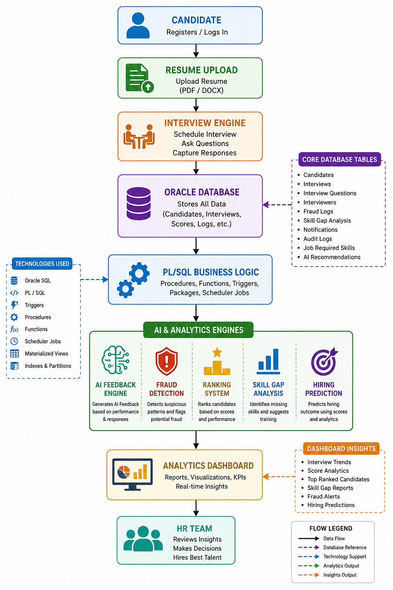
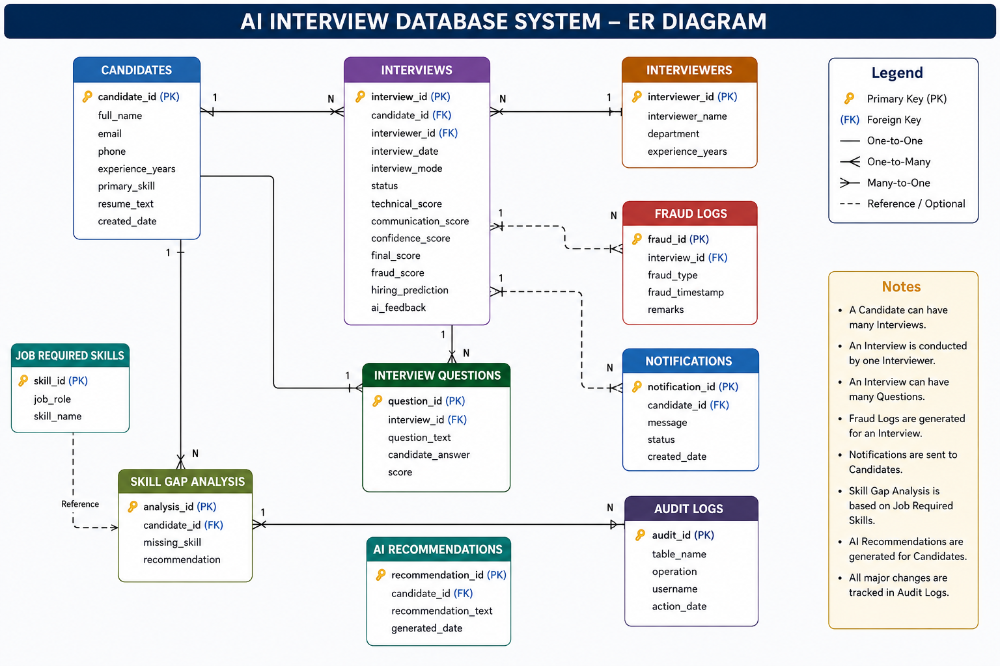
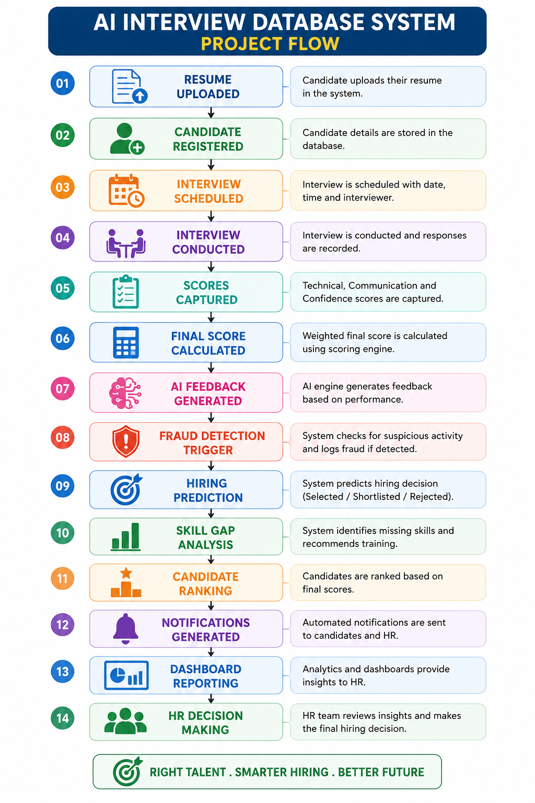

# AI Interview Database System

## Overview

Enterprise-grade AI Interview Database System built using Oracle SQL and PL/SQL to automate candidate evaluation, interview analytics, fraud detection, hiring prediction, and skill gap analysis.

The system helps organizations manage interview processes, rank candidates, identify suspicious interview behavior, generate AI-driven feedback, analyze skill gaps, and support data-driven hiring decisions.


---

## Features

✔ Candidate Management System

✔ Interview Scheduling & Tracking

✔ AI Feedback Generator

✔ Candidate Ranking Engine

✔ Final Score Calculation

✔ Hiring Prediction Model

✔ Fraud Detection Engine

✔ Resume Keyword Matching

✔ Skill Gap Analysis

✔ AI Recommendation Engine

✔ Interview Question Analytics

✔ Notification System

✔ Audit Logging

✔ Materialized Views

✔ Dashboard Reporting

✔ Data Warehouse Design

✔ Scheduler Jobs Automation

✔ Index Optimization

✔ Partitioned Tables

---

## Technology Stack

* Oracle Database
* SQL
* PL/SQL
* Triggers
* Functions
* Stored Procedures
* DBMS Scheduler
* Materialized Views
* Indexing
* Partitioning
* Data Warehouse Concepts

---

## Business Problem

Recruitment teams often struggle with:

* Manual candidate evaluation
* Lack of standardized scoring
* Difficulty identifying top talent
* Interview fraud and cheating
* Missing skill analysis
* Delayed feedback generation
* Lack of centralized analytics

This system solves these challenges through automation, analytics, and AI-driven recommendations.

---

## Project Architecture




---

## ER Diagram




---

## Database Modules

### Candidate Module

Stores:

* Candidate Information
* Resume Data
* Skills
* Experience

### Interview Module

Stores:

* Interview Scores
* Interview Mode
* Interview Status
* AI Feedback

### Fraud Detection Module

Detects:

* High Technical Score + Low Confidence
* Suspicious Interview Behavior
* Potential Cheating Patterns

### Analytics Module

Provides:

* Candidate Ranking
* Average Skill Scores
* Hiring Trends
* Interview Performance Metrics

---

## AI Feedback Engine

Automatically generates feedback based on:

* Technical Score
* Communication Score
* Confidence Score

### Example

| Score Range | Feedback            |
| ----------- | ------------------- |
| 85+         | Excellent Candidate |
| 70-84       | Good Candidate      |
| Below 70    | Needs Improvement   |

---

## Hiring Prediction Model

### Prediction Rules

| Final Score | Prediction  |
| ----------- | ----------- |
| 85+         | Selected    |
| 70-84       | Shortlisted |
| Below 70    | Reject      |

---

## Fraud Detection Rules

| Rule                            | Risk Indicator |
| ------------------------------- | -------------- |
| Technical > 90                  | Suspicious     |
| Confidence < 30                 | Suspicious     |
| High Technical + Low Confidence | Fraud Alert    |
| Multiple Fraud Logs             | High Risk      |

---

## Skill Gap Analysis

Compares:

Candidate Resume Skills

VS

Job Required Skills

Generates:

* Missing Skills
* Learning Recommendations
* Training Suggestions

### Example

| Required Skill | Candidate Has | Result    |
| -------------- | ------------- | --------- |
| SQL            | Yes           | Match     |
| Python         | Yes           | Match     |
| Databricks     | No            | Skill Gap |

---

## Candidate Recommendation Engine

Generates recommendations such as:

* Suitable for Senior Roles
* Suitable for Mid-Level Roles
* Requires Technical Training
* Recommended Learning Path

---

## Interview Question Analytics

Analyzes:

* Question-wise Performance
* Average Score Per Question
* Difficult Questions
* Candidate Weak Areas

---

## Dashboard Queries

### Top Ranked Candidates

```sql
SELECT candidate_id,
       final_score,
       RANK() OVER(ORDER BY final_score DESC)
FROM interviews;
```

### Fraud Reports

```sql
SELECT *
FROM fraud_logs;
```

### Skill Gap Reports

```sql
SELECT *
FROM skill_gap_analysis;
```

### HR Dashboard

```sql
SELECT *
FROM vw_hr_dashboard;
```

---

## Data Warehouse Design

### Fact Table

* FACT_INTERVIEW

### Dimension Tables

* DIM_CANDIDATE
* DIM_INTERVIEWER
* DIM_SKILL
* DIM_DATE

### Benefits

* Faster Analytics
* Historical Reporting
* Business Intelligence Support

---

## Performance Optimization

### Indexes

* Candidate Skill Index
* Interview Date Index
* Final Score Index

### Partitioning

Interview history partitioned by year:

* 2025
* 2026
* Future Years

### Materialized Views

Precomputed reporting for:

* Monthly Interview Trends
* Average Scores
* Candidate Statistics

---

## Scheduler Jobs

Automated Jobs:

✔ Daily Interview Reports

✔ Notification Processing

✔ Analytics Refresh

✔ Materialized View Refresh

---

## Project Flow




---

## Author

### Madhusudan

Data Engineer | SQL Developer | PLSQL Developer


---

